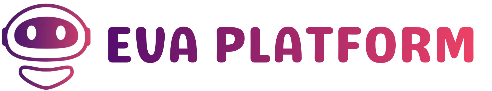

<p align="center">
  
</p>

<p align="center">
  <a href="https://laravel.com"></a>
  <a href="https://react.dev"></a>
  <a href="https://inertiajs.com"></a>
  <a href="https://www.mysql.com"></a>
  
  
</p>

## Sobre EVA

> Plataforma educativa web orientada a promover el uso de recursos educativos digitales en educación básica primaria, desarrollada con Laravel 12, React e Inertia.js.

---

## Descripción general

EVA Platform es una estrategia computacional desarrollada para facilitar la integración, gestión y uso de Objetos Virtuales de Aprendizaje (OVA) en contextos educativos de básica primaria. La plataforma permite la administración de usuarios, cursos, evaluaciones y recursos educativos digitales, incorporando además elementos de contextualización cultural nariñense y mecanismos de seguimiento académico.

El sistema fue construido bajo una arquitectura basada en Laravel, React e Inertia.js, permitiendo una experiencia tipo SPA sin necesidad de una API REST independiente.

---

## Objetivo

Desarrollar una estrategia computacional orientada a promover el uso de recursos educativos digitales en las áreas de básica primaria, en instituciones educativas del departamento de Nariño, en articulación con los lineamientos de la Secretaría de Educación Departamental.

---

## Tecnologías utilizadas

| Capa | Tecnología |
|------|-----------|
| Backend | PHP 8.4 · Laravel 11 |
| Frontend | React 18 · Inertia.js · Vite |
| Base de datos | MySQL 8.0 (producción) · SQLite (pruebas) |
| Estilos | Tailwind CSS |
| Autenticación | Laravel Breeze / Sanctum |
| Gestión de dependencias PHP | Composer 2.x |
| Gestión de dependencias JS | Node.js 18+ · npm 9+ |
| Servidor web | Apache 2.4+ o Nginx |

---

## Requisitos mínimos del sistema

| Componente | Requisito |
|-----------|-----------|
| PHP | 8.4 o superior (con extensiones: OpenSSL, PDO, Mbstring, Tokenizer, XML, Ctype, JSON, BCMath) |
| Servidor web | Apache 2.4+ (con mod_rewrite) o Nginx (con try_files) |
| Base de datos | MySQL 5.7+ (recomendado 8.0+) |
| Composer | 2.x |
| Node.js | 18+ |
| npm | 9+ |
| Navegadores | Chrome 90+, Firefox 88+, Edge 90+, Safari 14+ |

---

## Instalación y ejecución local

### 1. Clonar el repositorio

```bash
git clone https://github.com/Gabrieladelgado26/Eva_Platform.git
cd Eva_Platform
```

### 2. Instalar dependencias PHP

```bash
composer install
```

### 3. Configurar variables de entorno

```bash
cp .env.example .env
```

Editar el archivo `.env` con los valores correspondientes:

```env
APP_NAME=EVA
APP_ENV=local
APP_KEY=        # se genera en el paso siguiente
APP_URL=http://localhost

DB_CONNECTION=mysql
DB_HOST=127.0.0.1
DB_PORT=3306
DB_DATABASE=eva_platform
DB_USERNAME=tu_usuario
DB_PASSWORD=tu_contraseña

SESSION_DRIVER=database
QUEUE_CONNECTION=database
```

### 4. Generar la clave de aplicación

```bash
php artisan key:generate
```

### 5. Crear la base de datos y ejecutar migraciones con datos semilla

```bash
php artisan migrate --seed
```

> Este paso crea el esquema completo de la base de datos y ejecuta el `RoleSeeder` que genera los tres roles del sistema: **Administrador**, **Docente** y **Estudiante**.

### 6. Instalar dependencias frontend y compilar assets

```bash
npm install
npm run build
```

> Para desarrollo con hot-reload usar `npm run dev` en lugar de `npm run build`.

### 7. Iniciar el servidor de desarrollo

```bash
php artisan serve
```

---

## Configuración del servidor web (producción)

El directorio raíz del servidor web debe apuntar a `public/`. Ejemplo para Apache:

```apache
<VirtualHost *:80>
    ServerName eva.tudominio.com
    DocumentRoot /var/www/Eva_Platform/public

    <Directory /var/www/Eva_Platform/public>
        AllowOverride All
        Require all granted
    </Directory>
</VirtualHost>
```

Para Nginx, asegurarse de incluir la directiva `try_files $uri $uri/ /index.php?$query_string;`.

---

## Estructura del sistema

```
Eva_Platform/
├── app/
│   ├── Http/
│   │   ├── Controllers/        # Controladores por módulo
│   │   └── Middleware/         # Middlewares de autenticación y roles
│   ├── Models/                 # Modelos Eloquent
│   └── Policies/               # Políticas de autorización
├── database/
│   ├── migrations/             # Migraciones de base de datos
│   └── seeders/                # Seeders (RoleSeeder, UsersSeeder, etc.)
├── resources/
│   ├── js/
│   │   ├── Pages/              # Componentes de página React (por módulo)
│   │   └── Components/         # Componentes reutilizables
│   └── views/                  # Vistas Blade (layouts base)
├── routes/
│   ├── web.php                 # Rutas web principales
│   └── auth.php                # Rutas de autenticación
├── public/                     # Raíz pública del servidor web
│   └── build/                  # Assets compilados por Vite
└── .env.example                # Plantilla de variables de entorno
```

---

## Módulos principales

| Módulo | Descripción |
|--------|-------------|
| **Autenticación y roles** | Registro, inicio de sesión y control de acceso basado en roles (Administrador, Docente, Estudiante) |
| **Gestión de cursos** | Creación, edición y asignación de cursos a grupos de estudiantes |
| **OVA (Objetos Virtuales de Aprendizaje)** | Integración y visualización de contenidos interactivos por tema |
| **Actividades y evaluaciones** | Creación de actividades con retroalimentación automática |
| **Seguimiento de progreso** | Registro del avance y calificaciones de cada estudiante por actividad |
| **Analítica docente** | Dashboards con estadísticas de uso y desempeño (basados en funciones nativas de MySQL: `YEAR()`, `MONTH()`, `HOUR()`) |
| **Panel de administración** | Gestión de usuarios, cursos y configuración general de la plataforma |

---

## Usuarios de prueba

Tras ejecutar `php artisan migrate --seed`, el sistema crea los siguientes usuarios de prueba:

| Rol | Correo | Contraseña |
|-----|--------|-----------|
| Administrador | admin@eva.com | admin123 |
| Docente | fparra@gmail.com | admin123 |

> Las credenciales anteriores corresponden al entorno de desarrollo local. Cambiarlas antes de cualquier despliegue en producción.

---

## Orientaciones para la revisión del software

1. **Clonar y configurar** el proyecto siguiendo los pasos de instalación descritos arriba.
2. **Iniciar sesión** con cada uno de los usuarios de prueba para explorar las vistas y permisos según el rol.
3. **Revisar el módulo de OVA** accediendo a un curso activo desde la cuenta de Estudiante o Docente.
4. **Explorar la analítica** desde la cuenta de Docente o Administrador para visualizar los dashboards de seguimiento.
5. **Ejecutar las pruebas automatizadas** (si aplica) con:
   ```bash
   php artisan test
   ```
   Las pruebas usan SQLite como base de datos en memoria, por lo que no requieren una base de datos MySQL configurada.
6. Los módulos de analítica requieren **MySQL en producción** para el correcto funcionamiento de las funciones de fecha (`YEAR()`, `MONTH()`, `HOUR()`); en SQLite estas funciones no están disponibles.

---

## Licencia

Proyecto académico desarrollado como trabajo de grado. Todos los derechos reservados por los autores.